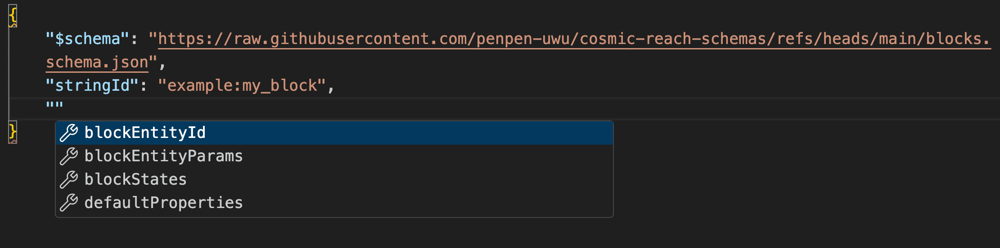

# Example usage
## Block schema
Add `https://raw.githubusercontent.com/penpen-uwu/cosmic-reach-schemas/refs/heads/main/blocks.schema.json` as the $schema like this:
```json
{
    "$schema": "https://raw.githubusercontent.com/penpen-uwu/cosmic-reach-schemas/refs/heads/main/blocks.schema.json",
    "stringId": "example:my_block"
}
```
Now autocompletions will show up  

